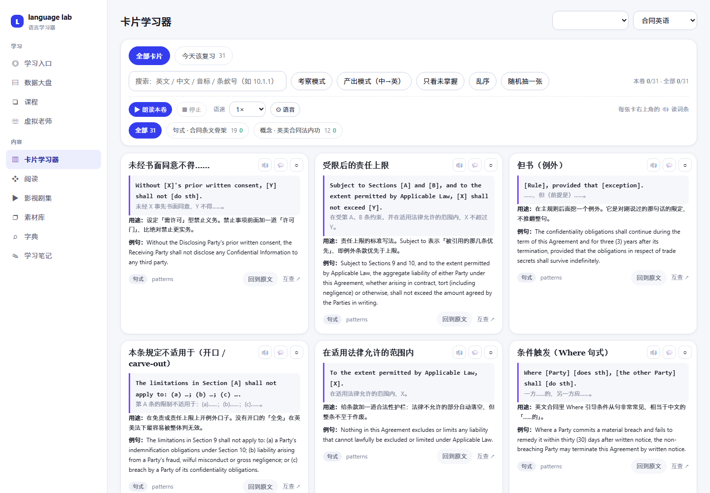
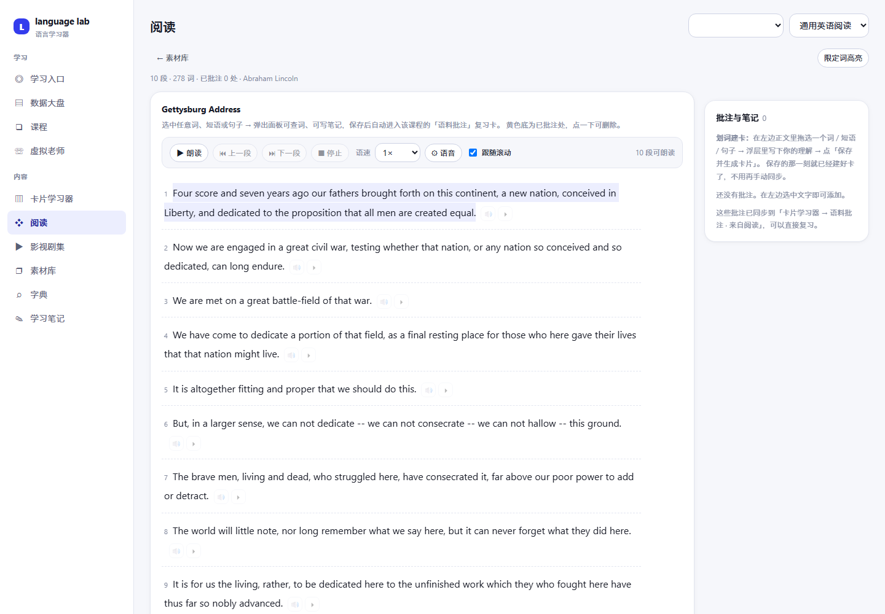
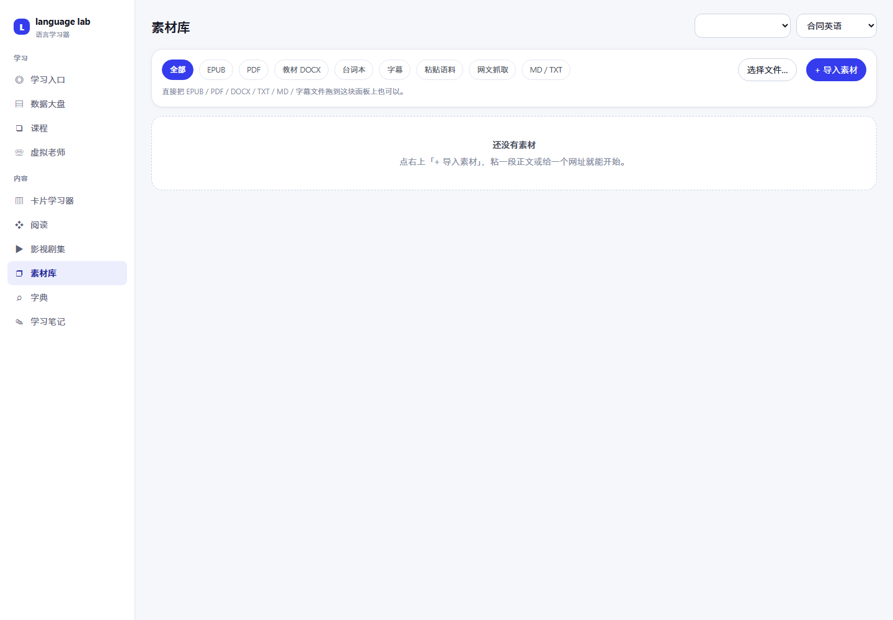
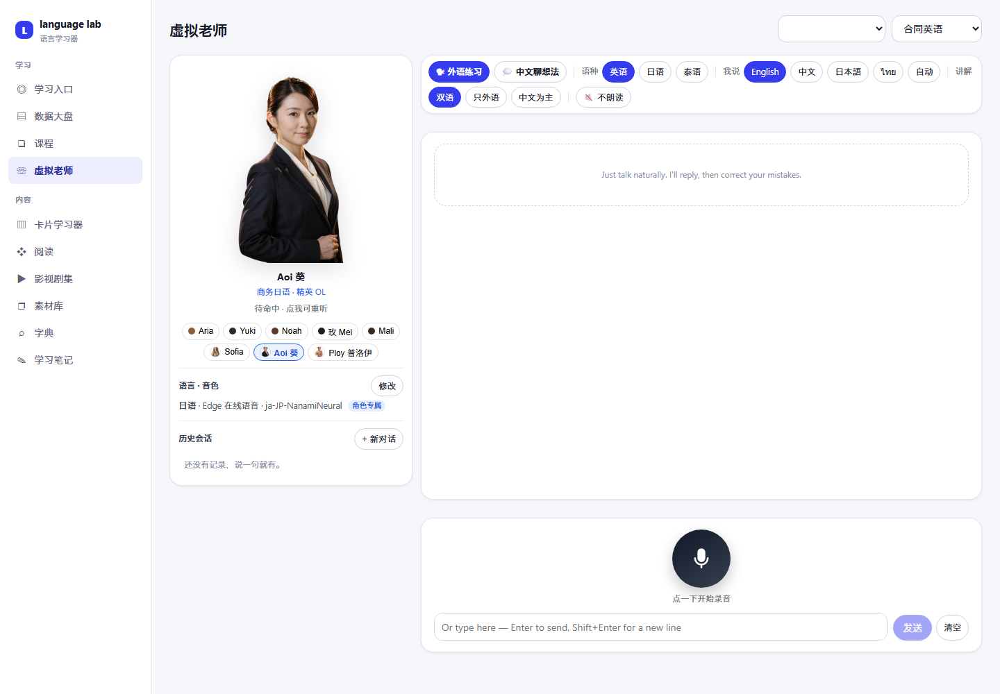
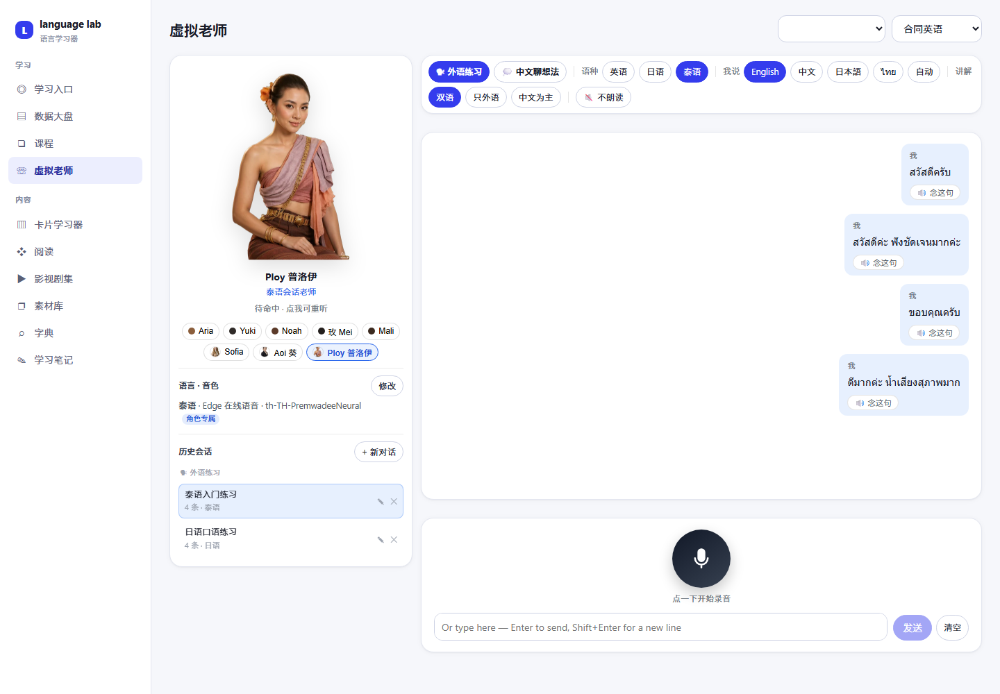
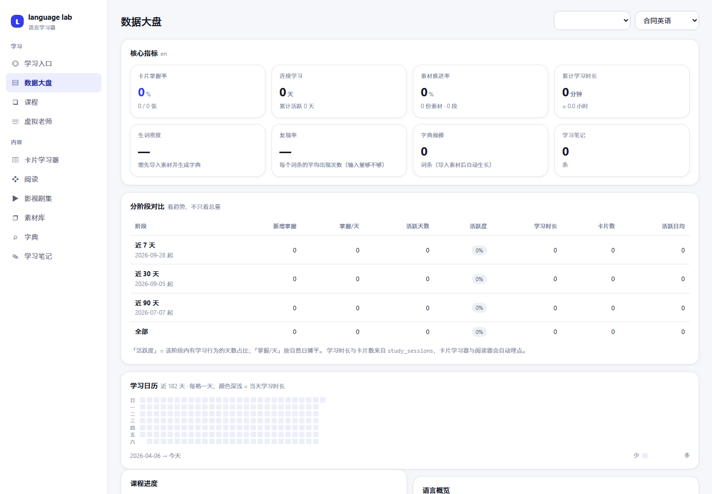
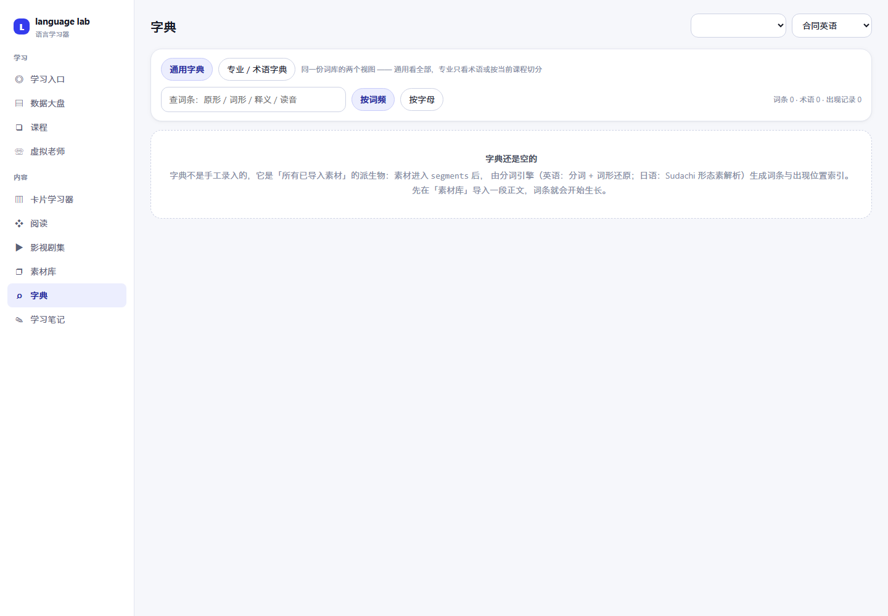

# langlab

[English](README.md) | [中文](README.zh-CN.md) | **日本語**

> **ローカル優先の多言語学習システム** —— 自分の本物の素材で言語を学ぶ。
> カード · 間隔反復 · 選択してカード作成 · 内蔵リーダー · AI チューター · ローカル発音診断



**言語を教えるのではなく、あなた自身の素材で訓練する。**

一般的な語学アプリが教えるのは**アプリ側のカリキュラム**です。langlab が訓練するのは
**あなたの素材** —— 業務契約書、業界メモ、海外ドラマ、電子書籍。単語を選択すればカードになり、
カードは自動で復習スケジュールに乗り、仮想チューターがあなたの音読を聴いて、
どこで詰まったかを指摘します。

**データはすべて自分のマシン上に：アップロードなし、サブスクなし、囲い込みなし。**

---

## 作者

**Aloysius Luo** —— AI フルスタック開発とサーバー運用。

- GitHub: [@tttworks](https://github.com/tttworks)
- 連絡先: a@tttworks.com
- issue / PR 歓迎（提出前に [CLA.md](CLA.md) をご一読ください）

---

## なぜこのプロジェクトが生まれたか

仕事の都合で、半年以内に英語を**専門文書を読み、交渉の席に着ける**レベルまで引き上げる
必要がありました。

昔ながらの方法で数千語を暗記し、そして気づきました ——
**会議室では、その単語が一つも出てこない。**
後で自分の話す声を録音して聴き返すと、**録音時間のおよそ半分は沈黙**でした。
そして綴りを間違えた単語は、ほぼすべて「発音から推測したもの」でした。
頭に蓄えられていたのは音であって、字面ではなかったのです。

そのとき理解しました：**私のボトルネックは「知らない」ことではなく、「取り出せない」ことだ。**

ところが市販のツールはすべて前者を解決しようとしていました。コーヒーの注文や天気の話は
教えてくれますが、私が本当に必要な場面は一文字も教えてくれません。しかも重要なのは、
**素材は足りていた**ということです —— 自分の分野の本物の英語資料が大量に手元にありました。
足りなかったのは、それを訓練に変えるシステム。そして資料は機密なので、
**自分のマシン上で動く必要がありました**。

こうして langlab が生まれました。現在の形は、
**その設計の一つひとつが上記の具体的なつまずきに遡れる**ようになっています。

📖 **[詳しい経緯：なぜ langlab が生まれたか](docs/STORY.md)**

---

## 誰に向いているか

- 本物の外国語素材を大量に「読み込み切る」必要がある実務者（法務 / 投資 / 医療 / 工学……）
- データ主権を重視し、クラウドアカウントを受け入れない人
- すでに「少しは分かる」が、**取り出せない・すらすら言えない**学習者

**向いていない人**：ゼロから言語を始める人（まず Duolingo や Babbel で基礎を作ってください）。

---

## 理論的裏づけ

各機能は、それぞれ特定の研究に対応しています。**引用はすべて原典を確認できます。**

| # | 機能 | 理論 | 提唱者 | 出典 |
|---|---|---|---|---|
| 1 | 素材は自分の本物の資料のみ | 理解可能インプット仮説（i+1） | **Stephen Krashen**<br>南カリフォルニア大学 名誉教授 | Krashen, S. D. (1985). *The Input Hypothesis: Issues and Implications*. Longman. |
| 2 | カードの間隔反復スケジューリング | 忘却曲線と間隔反復 | **Hermann Ebbinghaus**<br>**Piotr Woźniak** | Ebbinghaus, H. (1885). *Über das Gedächtnis*.<br>Woźniak, P. A., & Gorzelańczyk, E. J. (1994). Optimization of Repetition Spacing in the Practice of Learning. *Acta Neurobiologiae Experimentalis*, 54(1), 59–62. |
| 3 | 復習ログの記録（FSRS への準備） | 間隔反復スケジューリングの最適化 | **Ye Junyao / Su Jingyong / Cao Yilong** | Ye, J., Su, J., & Cao, Y. (2022). A Stochastic Shortest Path Algorithm for Optimizing Spaced Repetition Scheduling. *KDD '22*, 4381–4390. |
| 4 | 産出モード（中国語 → 英語で言う） | テスト効果 / 検索練習 | **Henry L. Roediger III**<br>**Jeffrey D. Karpicke** | Roediger, H. L., & Karpicke, J. D. (2006). Test-Enhanced Learning: Taking Memory Tests Improves Long-Term Retention. *Psychological Science*, 17(3), 249–255. |
| 5 | フレーム復述 + 録音自己評価 | アウトプット仮説 | **Merrill Swain**<br>トロント大学 | Swain, M. (1995). Three Functions of Output in Second Language Learning. In *Principle and Practice in Applied Linguistics*. Oxford University Press. |
| 6 | カードごとに発音記号 + 音節分割 | 二重符号化理論 | **Allan Paivio**<br>ウェスタンオンタリオ大学 | Paivio, A. (1986). *Mental Representations: A Dual Coding Approach*. Oxford University Press. |
| 7 | コロケーション + 出典の原句 | 語彙アプローチ | **Michael Lewis**<br>**Paul Nation** | Lewis, M. (1993). *The Lexical Approach*. Language Teaching Publications.<br>Nation, I. S. P. (2001). *Learning Vocabulary in Another Language*. Cambridge University Press. |
| 8 | 限定詞のハイライト / 段階的開放 | 認知負荷理論 | **John Sweller**<br>ニューサウスウェールズ大学 | Sweller, J. (1988). Cognitive Load During Problem Solving: Effects on Learning. *Cognitive Science*, 12(2), 257–285. |
| 9 | 発音診断における即時的で的を絞ったフィードバック | 意図的練習 | **K. Anders Ericsson** | Ericsson, K. A., Krampe, R. T., & Tesch-Römer, C. (1993). The Role of Deliberate Practice in the Acquisition of Expert Performance. *Psychological Review*, 100(3), 363–406. |
| 10 | 1 コース = 1 領域 | 狭い入力（Narrow Reading） | **Stephen Krashen** | Krashen, S. (2004). The Case for Narrow Reading. *Language Magazine*, 3(5), 17–19. |
| 11 | 選択した瞬間にカード化 | ⚠️ **学術理論ではありません** | — | 没入型学習コミュニティ（AJATT / Antimoon）の一般的な手法 |

> ⚠️ **第 11 項をあえて明示しています**：センテンス・マイニングは**コミュニティの実践**であり、
> 対応する論文はありません。「理論的裏づけ」に混ぜれば不誠実になる —— ただし実際に効果があるので、
> 明記した上で残しています。

### 他のアプローチとの違い

|  | コース型アプリ<br>（Duolingo など） | フラッシュカード<br>（Anki など） | **langlab** |
|---|---|---|---|
| コンテンツの出所 | プラットフォームの汎用コース | 自分でカードを作成 | **自分の本物の素材** |
| 記憶スケジューリング | 弱い | 最強 | あり（SM-2、FSRS 用データも記録済み） |
| 産出訓練 | 限定的 | カードの作り方次第 | **産出モードを内蔵** |
| 音声フィードバック | 基本的な認識 | なし | **ローカル発音診断** |
| リーディング統合 | なし | なし | **内蔵リーダー + 選択でカード作成** |
| データの所在 | クラウドアカウント | ローカル | **ローカル** |
| 導入コスト | 低い（開けば学べる） | 高い（ツールチェーンを自作） | 中程度（素材は自分で用意） |

**それぞれの役割を一行で：**

- **コース型アプリ**は「何を学ぶか分からない」を解決する —— **コンテンツを与える**；
- **フラッシュカード**は「覚えたい」を解決する —— ただし**カードも素材も自分で用意する**；
- **langlab** は「手元の素材を読み込み切りたい」を解決する ——
  **読む・カード化・復習・発音フィードバック**を一本の流れにつなぎます。

> ⚠️ 最後に：以上は**設計の根拠**であり、「使えば必ず習得できる」という保証ではありません。
> 言語習得に銀の弾丸はありません。

---

## 機能

### カード学習
6 種類のカード（単語 / 用語 / チャンク / 文型 / 概念 / 注記）。
受容・産出の両モード。シャッフル、ランダム抽出、読み上げ、習得済みマーク。


### 内蔵リーダー · 選択でカード作成
EPUB / PDF を元のレイアウトで、または文ごとに描画する**精読モード**（対訳付き）で。
分からない箇所に当たったら：**選択 → ワンクリックでカード化**、出典と文脈も自動的に付きます。



素材はファイルのアップロード、ローカルパスの登録、テキストの貼り付け、URL 取得に対応：



### 仮想チューター · ローカル発音診断
マルチロール会話（英語 / 日本語 / タイ語）、**アバターは言語に応じて切り替わり**、
会話履歴は自動保存されいつでも続きから。
さらに重要なのは —— **本当にあなたの音読を聴く**ことです。録音はローカルで Whisper により
解析され、どこで発音を誤ったか、不明瞭だったか、詰まったかを指摘し、
的を絞ったコメントを一つ返します。**音声はマシンの外に出ません。**

**日本語 · Aoi**



**タイ語 · Ploy**



### データダッシュボード
主要指標 + 段階別の比較 + 182 日ヒートマップ。



### 辞書と素材ライブラリ
一般辞書 / 専門用語辞書（同一の語彙データを 2 つのビューで）。
素材はファイルのアップロード、ローカルパス登録、貼り付け、URL 取得に対応。



---

## クイックスタート

**動作環境**：PHP 8.2+、Node 18+、（任意）Python 3.11+（発音診断と音声合成に使用）。

```bash
# 1) バックエンドの依存関係
cd backend && composer install

# 2) 設定（すべてのキーは任意 —— 一つも入れなくても動きます）
cp data/.env.example data/.env

# 3) データベース —— この 3 ステップは順序を変えられません
php scripts/init.php         # テーブル作成（⚠️ DROP して再作成、空の DB でのみ）
php scripts/migrate.php      # 後から追加された列を補う（冪等、何度でも可）
php scripts/seed_demo.php    # 任意：デモカードを投入してすぐ試す

# 4) フロントエンド
cd ../frontend && npm install && npm run dev
```

ブラウザで <http://localhost:5174> を開きます。

> Windows では、リポジトリ直下の **`start.bat`** をダブルクリックするだけでも可
> （`php` と `npm` に PATH が通っている必要があります）。

---

## 自分の素材を取り込む

リポジトリに**コーパスは含まれていません** —— 起動直後は空のデータベースで、素材は自分で入れます。
取り込み方は 4 通り、いずれも **素材ライブラリ**（`#/materials`）画面から：

### 方法 1：ファイルをアップロード（最も一般的）
1. **素材ライブラリ** → 「ファイルをアップロード」をクリック、またはファイルをページにドロップ
2. **EPUB / PDF / DOCX / TXT / SRT / 台本** に対応
3. **コース**と**言語**を選んで送信
4. テキスト抽出・段落分割・索引付けを自動実行（大きいファイルは分割処理、進捗も表示）

### 方法 2：ローカルパスを登録（ファイルをコピーしない）
書籍が多く、ディスク上に二重に持ちたくない場合に。
1. 「ローカルパスを登録」に**絶対パス**（ファイルまたはディレクトリ）を入力
2. パスを登録するだけで、**元ファイルはコピーも変更もされません**
3. ディレクトリは再帰的に走査され、コースごとに分類されます

### 方法 3：テキストを貼り付け
断片的な素材（メールの一節、ニュース記事）はそのまま貼り付け。

### 方法 4：URL から取得
URL を入力すると本文を抽出しタグを除去します。取得できない場合は「貼り付け」を促します
（多くのサイトがスクレイピングを遮断しています）。

### 取り込んだ後
- **読む**：素材ライブラリから開く → 精読モードが文単位で描画、対訳表示と読み上げも可
- **カード化**：任意のテキストを選択 → ポップオーバーの「保存してカード生成」、AI に語義と発音記号を補わせることも可
- **復習**：カード学習 → 「今日の復習」、SM-2 でスケジュール
- **映像・ドラマ**：`SRT + 動画` を一緒に取り込むと、カテゴリ → タイトル・シーズン → 各話 の 3 段階ブラウザになります

> ⚠️ **使用権のある素材のみ取り込んでください。** 取り込んだ内容の適法性は利用者の責任です。

---

## デモデータ

`backend/data/demo_cards.json` は**手書き**のサンプルカード 31 枚
（契約文型の骨組み 19 + 法律概念 12）。clone した人がすぐ効果を確認できるように用意しています。

- **実際の契約書・顧客ファイル・商用資料からは一切取っていません**。機関名・金額・商談内容も含みません
- ライセンスは **CC0（パブリックドメイン）** —— 自由に使え、自由に改変できます
- `php scripts/seed_demo.php` で投入（冪等、何度でも可）
- 投入後はコース「契約英語（サンプル）」に表示されます

自分の内容に差し替えたい場合は、`demo_cards.json` を直接編集するか、
上記の方法で実際の素材を入れてください。

---

## やらないこと

- **カリキュラムは作りません** —— ゼロから流暢までの教材は提供せず、素材は自分で用意します
- **クラウド同期はしません** —— データは手元に。複数環境での利用は各自で
- **一切データを収集しません** —— テレメトリなし、アカウントなし、外部送信なし

AI 会話機能を除き、**すべてオフラインで動作します**（カード・読書・復習・発音診断はすべてローカル）。

---

## ライセンス

| 対象 | ライセンス |
|---|---|
| コード | [MIT](LICENSE) |
| ドキュメント | [CC BY 4.0](CONTENT-LICENSE.md) |
| デモデータ | CC0（パブリックドメイン） |
| キャラクター素材 | コードに含めて MIT |

第三者コンポーネントのライセンスは [THIRD-PARTY-NOTICES.md](THIRD-PARTY-NOTICES.md) を参照。
コードを貢献する前に [CLA.md](CLA.md) をお読みください。
