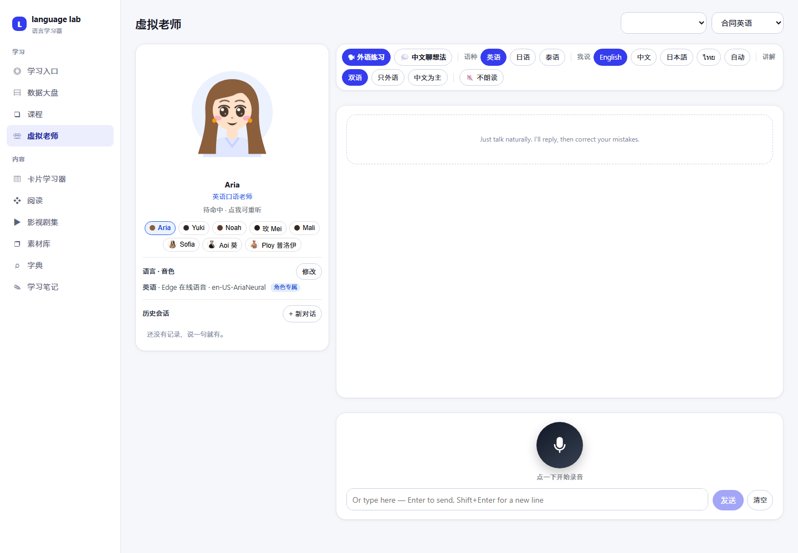

# langlab · 语言学习器

> **本地优先的多语种学习系统** —— 用自己的真实材料学语言。
> 卡片 · 间隔重复 · 划词建卡 · 内嵌阅读器 · AI 虚拟老师 · 本地发音诊断


**它不教你语言，它训练你用自己的材料。**

市面上的语言 App 教的是**它们的课程**；langlab 训练的是**你自己的材料** ——
工作合同、行业 Memo、外文剧集、电子书。划词就建卡，卡片自动排期复习，
还有一个虚拟老师能听你念、指出你在哪里卡壳。

**所有数据都在你自己的机器上：不上传、不订阅、不锁定。**

---

## 作者

**Aloysius Luo** —— 独立开发者，做 AI 全栈 Web 开发与服务器运维。
这个系统最初是给自己准备的：半年后要去日本做投资业务，需要把
真实的英文合同、Memo、投资文件「吃透」，而市面上的 App 教不了这些。

- GitHub：[@tttworks](https://github.com/tttworks)
- 联系：a@tttworks.com
- 欢迎 issue / PR（提交前请阅读 [CLA.md](CLA.md)）

---

## 它适合谁

- 有大量真实外文材料要「吃透」的从业者（法律 / 投资 / 医疗 / 工程……）
- 在意数据主权、不接受云账号的人
- 已经「会一点」但**取不出来、说不顺**的学习者

**它不适合**：从零开始学一门语言的人（那请先用 Duolingo / Babbel 打基础）。

---

## 教学上的理论支撑

这不是一个「拍脑袋做的 App」。下面每一条都是系统某个具体设计的依据 ——
**反过来读，也能看出这个系统刻意没做什么**。

### 1. 可理解输入（Comprehensible Input）
Krashen 的输入假说认为，语言能力来自略高于当前水平的**可理解输入**（i+1）。
难点在于「i+1」的量很难把握 —— 而**你自己领域的材料天然就在这个区间**：
你熟悉业务，但不熟外语表达。
> **对应设计**：语料只从你自己的文件来；不提供通用课程。

### 2. 语境中的词汇习得（Contextual Vocabulary Acquisition）
孤立背词表的遗忘率极高。词汇在**多个真实语境**中出现时，保留率显著提升。
> **对应设计**：每张卡带**出处原句**（来自你读的那一段）+ **通用例句** + **固定搭配**，
> 而不是孤零零一个词。

### 3. 间隔重复（Spaced Repetition）
基于艾宾浩斯遗忘曲线的调度：在「快要忘」的时刻复习，效率最高。
> **对应设计**：内置 SM-2 调度；同时已在记录 FSRS（新一代调度算法）所需的
> 完整复习流水，便于将来平滑升级。

### 4. 检索练习与测试效应（Retrieval Practice / Testing Effect）
主动回忆的效果远好于重复阅读 —— 这是认知心理学里被反复验证的结论。
> **对应设计**：**产出模式**（看中文 → 自己说出英文 → 再翻面对照），
> 而不是只做「认得出来」的被动识别。

### 5. 产出假说（Output Hypothesis）
理解能力和产出能力是两条不同的通道，只输入不足以形成产出能力。
> **对应设计**：产出模式 + 框架复述 + 录音自评。

### 6. 句子挖掘 / 语境卡片（Sentence Mining）
沉浸学习社区（AJATT、Antimoon）的通行做法：在真实内容里遇到好句子，
立刻挖出来做成卡，而不是事后靠回忆整理。
> **对应设计**：阅读时**划词/划句即建卡**，自动带上出处与语境。

### 7. 窄式输入（Narrow Input）
在同一主题内持续大量输入，词汇重复率高、语境彼此印证，进步快于「什么都看一点」。
> **对应设计**：一门课程对应一个领域（合同英语 / 投资谈判），而不是打散成通用话题。

### 8. 双重编码与字形锚点（Dual Coding）
音、形、义多渠道编码，比单通道记得牢。对「按声音记词」的学习者，
**缺字形锚点**是常见短板。
> **对应设计**：每张卡带 **IPA 音标** + **音节切分**（标注重音）。

### 9. 刻意练习（Deliberate Practice）
进步来自针对薄弱环节的即时反馈，而不是泛泛地多练。
> **对应设计**：**发音诊断**指出具体问题（念错词 / 含糊 / 卡壳 / 漏读）；
> 阅读器**限定词高亮**专攻扫读盲区。

### 10. 降低认知负荷（Cognitive Load）
无关信息占用的注意力，就是不留给语言本身的注意力。
> **对应设计**：限定词高亮、分阶段放行（避免一次涌入几百张卡）、
> 干净的界面（零外链、零广告）。

> ⚠️ 说明：以上是**设计依据**，不是「用了它就一定能学会」的保证。
> 语言习得没有银弹，这个系统只是把已被验证有效的几件事，做成了能天天用的工具。

---

## 功能

### 卡片学习器
6 种卡片类型（单词 / 术语 / 语块 / 句式 / 概念 / 批注）；
接受性与产出性双模式；乱序、随机抽、朗读、标记掌握。


### 内嵌阅读器 · 划词建卡
EPUB / PDF 内嵌原版排版，或按句渲染的**精读模式**（带对照译文）。
读到不会的地方，**选中 → 一键成卡**，自动带上出处与语境。


### 虚拟老师 · 本地发音诊断
多角色对话（英语 / 日语 / 泰语），并且 —— 它会**真的听你念**：
录音在本地用 whisper 分析，指出你哪里念错、含糊、卡壳，
再给一条针对性的点评。**音频不出本机。**



### 数据大盘
核心指标 + 分阶段对比 + 182 天热力图。


### 字典与素材库
通用字典 / 专业术语字典（同一份词库两个视图）；
素材支持上传文件、登记本地路径、粘贴文本、网址抓取。


---

## 快速开始

**环境**：PHP 8.2+、Node 18+；（可选）Python 3.11+ 用于发音诊断与语音合成。

```bash
# 1) 后端依赖
cd backend && composer install

# 2) 配置（所有 Key 都是可选的，一个都不填也能跑）
cp data/.env.example data/.env

# 3) 建库 —— 三步顺序不能反
php scripts/init.php         # 首次建表（⚠️ 会 DROP 重建，只在空库时用）
php scripts/migrate.php      # 补齐后续新增的列（幂等，可反复跑）
php scripts/seed_demo.php    # 可选：导入演示卡片，先看看效果

# 4) 前端
cd ../frontend && npm install && npm run dev
```

浏览器打开 <http://localhost:5174>。

> Windows 用户也可以直接双击根目录的 **`start.bat`**（要求 php 与 npm 已在 PATH 中）。

---

## 导入自己的语料（操作说明）

仓库**不含任何语料** —— 系统跑起来是空库，材料要你自己灌。
四种方式，都在 **素材库**（`#/materials`）页面：

### 方式一：上传文件（最常用）
1. 打开 **素材库** → 点「上传文件」或直接把文件拖进页面
2. 支持 **EPUB / PDF / DOCX / TXT / SRT / 台词本**
3. 选择所属**课程**与**语言**，提交
4. 系统自动抽文本、分段落、建索引（大文件会分块处理，进度可见）

### 方式二：登记本地路径（不复制文件）
适合书很多、不想占两份空间的场景。
1. 在「登记本地路径」里填**绝对路径**（文件或整个目录）
2. 只登记路径，**不复制、不改动原文件**
3. 目录会被递归扫描并按课程归类

### 方式三：粘贴文本
零散的材料（一段邮件、一条新闻）直接粘进去即可。

### 方式四：抓取网址
填 URL，系统抓正文并去掉标签。抓不到时会提示改用「粘贴」（很多站点有反爬）。

### 导入之后
- **阅读**：从素材库点开 → 精读模式按句渲染，可对照译文、可朗读
- **建卡**：选中任意文本 → 浮层里「保存并生成卡片」，可选让 AI 补释义与音标
- **复习**：卡片学习器 → 「今天该复习」，按 SM-2 排期
- **影视剧集**：`SRT + 视频` 一并导入后，会在「影视剧集」里形成 类别 → 剧名·季 → 每集 三级浏览

> ⚠️ **请只导入你有权使用的材料。** 使用者对其导入内容的合法性自行负责。

---

## 演示数据（demo）

`backend/data/demo_cards.json` 是**人工编写**的 31 张示例卡
（19 个合同句型骨架 + 12 个法律概念），用来让 clone 下来的人立刻看到效果。

- **不来自任何真实合同、客户文件或商业资料**，不含机构名称、金额或商业安排
- 许可是 **CC0（公共领域）** —— 随便用、随便改
- 通过 `php scripts/seed_demo.php` 导入（幂等，可反复跑）
- 导入后会出现在课程「合同英语（示例）」下

想换成自己的内容？直接编辑 `demo_cards.json`，或按上面的方式灌真实语料。

---

## 它不做什么

- **不做课程** —— 不提供从零到流利的教学内容，材料要你自备
- **不做云同步** —— 数据在本机，多处使用请自行处理
- **不收集任何数据** —— 没有遥测、没有账号、没有上报

除 AI 对话功能外，**全部离线可用**（卡片、阅读、复习、发音诊断都在本机跑）。

---

## 许可

| 对象 | 许可 |
|---|---|
| 代码 | [MIT](LICENSE) |
| 文档 | [CC BY 4.0](CONTENT-LICENSE.md) |
| 演示数据 | CC0（公共领域） |
| 形象素材 | 随代码，MIT |

第三方组件的许可见 [THIRD-PARTY-NOTICES.md](THIRD-PARTY-NOTICES.md)。
贡献代码前请阅读 [CLA.md](CLA.md)。
