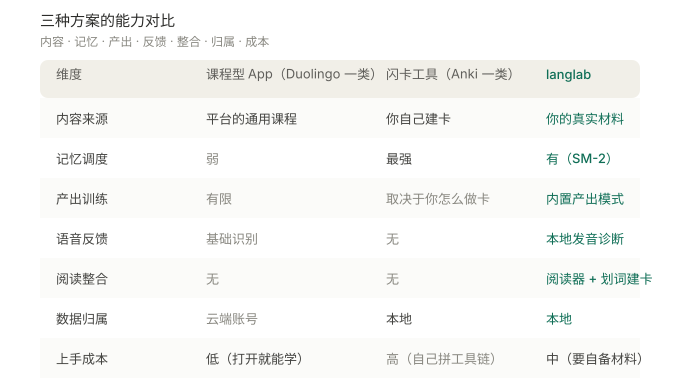

# langlab · 语言学习器

> **本地优先的多语种学习系统** —— 用自己的真实材料学语言。
> 卡片 · 间隔重复 · 划词建卡 · 内嵌阅读器 · AI 虚拟老师 · 本地发音诊断


**它不教你语言，它训练你用自己的材料。**

市面上的语言 App 教的是**它们的课程**；langlab 训练的是**你自己的材料** ——
工作合同、行业 Memo、外文剧集、电子书。划词就建卡，卡片自动排期复习，
还有一个虚拟老师能听你念、指出你在哪里卡壳。

**所有数据都在你自己的机器上：不上传、不订阅、不锁定。**

---

## 作者

**Aloysius Luo** —— AI 全栈开发与服务器运维。

- GitHub：[@tttworks](https://github.com/tttworks)
- 联系：a@tttworks.com
- 欢迎 issue / PR（提交前请阅读 [CLA.md](CLA.md)）

---

## 为什么会有这个项目

因为工作变动，我需要在半年内把英语提到能**读专业文件、能坐下来谈判**的程度。

我按老办法背了几千个单词，然后发现一件沮丧的事：**在会议室里，那些词一个都调不出来。**
后来我把自己的话录下来回听 —— **将近一半的录音时间是沉默**；而写错的单词，
几乎全是「按发音猜的」。我脑子里存的是声音，不是字形。

那一刻我明白了：**我的瓶颈不是「不认识」，是「取不出来」。**

而市面上的工具都在解决前一个问题 —— 它们教你点咖啡、聊天气，
可我真正要用的场景它一个字都不教。更关键的是，**我不缺材料**：
我手上有大量真实的、我自己领域的英文文件。
我缺的是把这些材料变成训练的系统 —— 而且因为材料涉密，它必须跑在我自己的机器上。

于是就有了 langlab。它长成现在这样，**每一条设计都能追溯到上面某个具体的卡点**。

📖 **[完整故事：为什么会有 langlab](docs/STORY.md)**

---

## 它适合谁

- 有大量真实外文材料要「吃透」的从业者（法律 / 投资 / 医疗 / 工程……）
- 在意数据主权、不接受云账号的人
- 已经「会一点」但**取不出来、说不顺**的学习者

**它不适合**：从零开始学一门语言的人（那请先用 Duolingo / Babbel 打基础）。

---

## 教学上的理论支撑

系统的每一项功能，背后都对应一位学者的研究。**凡是引用，都能查到原文。**

| # | 功能 | 依据的理论 | 提出者 | 出处 |
|---|---|---|---|---|
| 1 | 语料只用自己的真实材料 | 可理解输入假说（i+1） | **Stephen Krashen**<br>南加州大学荣休教授 | Krashen, S. D. (1985). *The Input Hypothesis: Issues and Implications*. Longman. |
| 2 | 卡片间隔重复排期 | 遗忘曲线与间隔重复 | **Hermann Ebbinghaus**<br>**Piotr Woźniak** | Ebbinghaus, H. (1885). *Über das Gedächtnis*.<br>Woźniak, P. A., & Gorzelańczyk, E. J. (1994). Optimization of Repetition Spacing in the Practice of Learning. *Acta Neurobiologiae Experimentalis*, 54(1), 59–62. |
| 3 | 记录复习流水（为 FSRS 准备） | 间隔重复调度优化 | **叶峻峣 / 苏敬勇 / 曹译珑** | Ye, J., Su, J., & Cao, Y. (2022). A Stochastic Shortest Path Algorithm for Optimizing Spaced Repetition Scheduling. *KDD '22*, 4381–4390. |
| 4 | 产出模式（看中文 → 说英文） | 测试效应 / 检索练习 | **Henry L. Roediger III**<br>**Jeffrey D. Karpicke** | Roediger, H. L., & Karpicke, J. D. (2006). Test-Enhanced Learning: Taking Memory Tests Improves Long-Term Retention. *Psychological Science*, 17(3), 249–255. |
| 5 | 框架复述 + 录音自评 | 输出假说 | **Merrill Swain**<br>多伦多大学 | Swain, M. (1995). Three Functions of Output in Second Language Learning. In *Principle and Practice in Applied Linguistics*. Oxford University Press. |
| 6 | 每张卡带音标 + 音节切分 | 双重编码理论 | **Allan Paivio**<br>西安大略大学 | Paivio, A. (1986). *Mental Representations: A Dual Coding Approach*. Oxford University Press. |
| 7 | 固定搭配 + 出处原句 | 词汇法（Lexical Approach） | **Michael Lewis**<br>**Paul Nation** | Lewis, M. (1993). *The Lexical Approach*. Language Teaching Publications.<br>Nation, I. S. P. (2001). *Learning Vocabulary in Another Language*. Cambridge University Press. |
| 8 | 限定词高亮 / 分阶段放行 | 认知负荷理论 | **John Sweller**<br>新南威尔士大学 | Sweller, J. (1988). Cognitive Load During Problem Solving: Effects on Learning. *Cognitive Science*, 12(2), 257–285. |
| 9 | 发音诊断的即时针对性反馈 | 刻意练习 | **K. Anders Ericsson** | Ericsson, K. A., Krampe, R. T., & Tesch-Römer, C. (1993). The Role of Deliberate Practice in the Acquisition of Expert Performance. *Psychological Review*, 100(3), 363–406. |
| 10 | 一门课对应一个领域 | 窄式输入 | **Stephen Krashen** | Krashen, S. (2004). The Case for Narrow Reading. *Language Magazine*, 3(5), 17–19. |
| 11 | 划词即建卡 | ⚠️ **不是学术理论** | — | 沉浸学习社区（AJATT / Antimoon）的通行做法 |

> ⚠️ **第 11 条特意标出来**：句子挖掘（sentence mining）是**社区实践**，没有对应的学术论文。
> 把它混进「理论支撑」里会不诚实 —— 但它确实有效，所以保留，只是标注清楚。

### 与其他方案的区别



|  | 课程型 App<br>（Duolingo 一类） | 闪卡工具<br>（Anki 一类） | **langlab** |
|---|---|---|---|
| 内容来源 | 平台的通用课程 | 你自己建卡 | **你自己的真实材料** |
| 记忆调度 | 弱 | 最强 | 有（SM-2，已记 FSRS 数据） |
| 产出训练 | 有限 | 取决于你怎么做卡 | **内置产出模式** |
| 语音反馈 | 基础识别 | 无 | **本地发音诊断** |
| 阅读整合 | 无 | 无 | **内嵌阅读器 + 划词建卡** |
| 数据归属 | 云端账号 | 本地 | **本地** |
| 上手成本 | 低（打开就能学） | 高（要自己拼装工具链） | 中（要自备材料） |

**一句话概括三者的分工**：

- **课程型 App** 解决「我不知道学什么」—— 它们**给你内容**；
- **闪卡工具** 解决「我要背下来」—— 但**卡要自己做、材料要自己找**；
- **langlab** 解决「我手上有一堆材料要吃掉」—— 它把**阅读、建卡、复习、发音反馈**串成一条链。

> ⚠️ 最后说明：以上是**设计依据**，不是「用了它就一定能学会」的保证。语言习得没有银弹。

---

## 功能

### 卡片学习器
6 种卡片类型（单词 / 术语 / 语块 / 句式 / 概念 / 批注）；
接受性与产出性双模式；乱序、随机抽、朗读、标记掌握。


### 内嵌阅读器 · 划词建卡
EPUB / PDF 内嵌原版排版，或按句渲染的**精读模式**（带对照译文）。
读到不会的地方，**选中 → 一键成卡**，自动带上出处与语境。


### 虚拟老师 · 本地发音诊断
多角色对话（英语 / 日语 / 泰语），**形象随语言切换**，并且 —— 它会**真的听你念**：
录音在本地用 whisper 分析，指出你哪里念错、含糊、卡壳，再给一条针对性的点评。
**音频不出本机。**

| 日语 · Aoi | 泰语 · Ploy |
|---|---|
|  |  |

### 数据大盘
核心指标 + 分阶段对比 + 182 天热力图。


### 字典与素材库
通用字典 / 专业术语字典（同一份词库两个视图）；
素材支持上传文件、登记本地路径、粘贴文本、网址抓取。


---

## 快速开始

**环境**：PHP 8.2+、Node 18+；（可选）Python 3.11+ 用于发音诊断与语音合成。

```bash
# 1) 后端依赖
cd backend && composer install

# 2) 配置（所有 Key 都是可选的，一个都不填也能跑）
cp data/.env.example data/.env

# 3) 建库 —— 三步顺序不能反
php scripts/init.php         # 首次建表（⚠️ 会 DROP 重建，只在空库时用）
php scripts/migrate.php      # 补齐后续新增的列（幂等，可反复跑）
php scripts/seed_demo.php    # 可选：导入演示卡片，先看看效果

# 4) 前端
cd ../frontend && npm install && npm run dev
```

浏览器打开 <http://localhost:5174>。

> Windows 用户也可以直接双击根目录的 **`start.bat`**（要求 php 与 npm 已在 PATH 中）。

---

## 导入自己的语料（操作说明）

仓库**不含任何语料** —— 系统跑起来是空库，材料要你自己灌。
四种方式，都在 **素材库**（`#/materials`）页面：

### 方式一：上传文件（最常用）
1. 打开 **素材库** → 点「上传文件」或直接把文件拖进页面
2. 支持 **EPUB / PDF / DOCX / TXT / SRT / 台词本**
3. 选择所属**课程**与**语言**，提交
4. 系统自动抽文本、分段落、建索引（大文件会分块处理，进度可见）

### 方式二：登记本地路径（不复制文件）
适合书很多、不想占两份空间的场景。
1. 在「登记本地路径」里填**绝对路径**（文件或整个目录）
2. 只登记路径，**不复制、不改动原文件**
3. 目录会被递归扫描并按课程归类

### 方式三：粘贴文本
零散的材料（一段邮件、一条新闻）直接粘进去即可。

### 方式四：抓取网址
填 URL，系统抓正文并去掉标签。抓不到时会提示改用「粘贴」（很多站点有反爬）。

### 导入之后
- **阅读**：从素材库点开 → 精读模式按句渲染，可对照译文、可朗读
- **建卡**：选中任意文本 → 浮层里「保存并生成卡片」，可选让 AI 补释义与音标
- **复习**：卡片学习器 → 「今天该复习」，按 SM-2 排期
- **影视剧集**：`SRT + 视频` 一并导入后，会在「影视剧集」里形成 类别 → 剧名·季 → 每集 三级浏览

> ⚠️ **请只导入你有权使用的材料。** 使用者对其导入内容的合法性自行负责。

---

## 演示数据（demo）

`backend/data/demo_cards.json` 是**人工编写**的 31 张示例卡
（19 个合同句型骨架 + 12 个法律概念），用来让 clone 下来的人立刻看到效果。

- **不来自任何真实合同、客户文件或商业资料**，不含机构名称、金额或商业安排
- 许可是 **CC0（公共领域）** —— 随便用、随便改
- 通过 `php scripts/seed_demo.php` 导入（幂等，可反复跑）
- 导入后会出现在课程「合同英语（示例）」下

想换成自己的内容？直接编辑 `demo_cards.json`，或按上面的方式灌真实语料。

---

## 它不做什么

- **不做课程** —— 不提供从零到流利的教学内容，材料要你自备
- **不做云同步** —— 数据在本机，多处使用请自行处理
- **不收集任何数据** —— 没有遥测、没有账号、没有上报

除 AI 对话功能外，**全部离线可用**（卡片、阅读、复习、发音诊断都在本机跑）。

---

## 许可

| 对象 | 许可 |
|---|---|
| 代码 | [MIT](LICENSE) |
| 文档 | [CC BY 4.0](CONTENT-LICENSE.md) |
| 演示数据 | CC0（公共领域） |
| 形象素材 | 随代码，MIT |

第三方组件的许可见 [THIRD-PARTY-NOTICES.md](THIRD-PARTY-NOTICES.md)。
贡献代码前请阅读 [CLA.md](CLA.md)。
